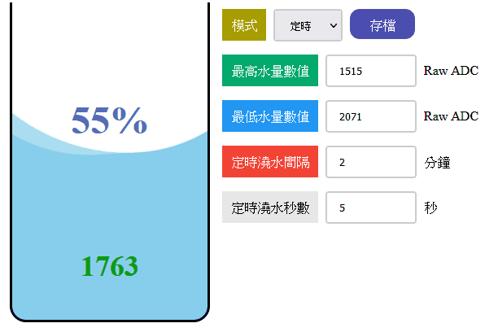
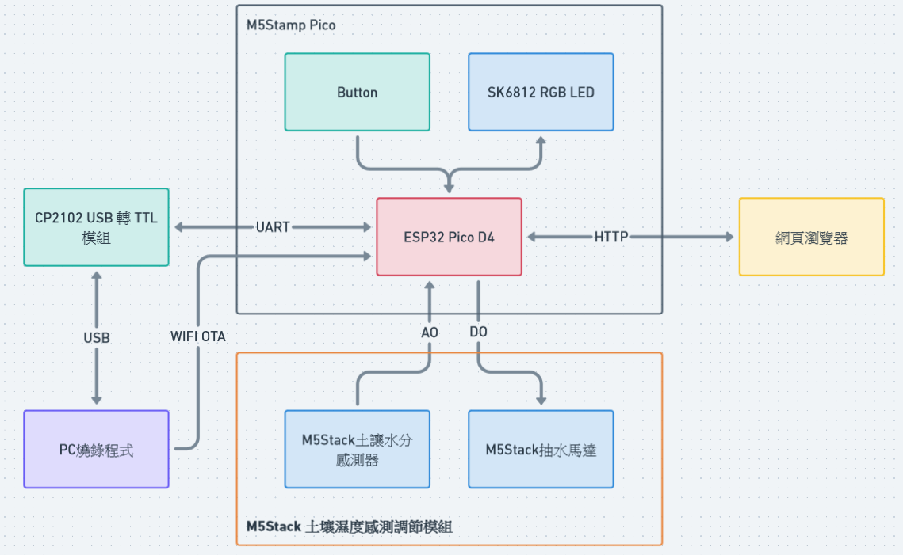

# Smart Sprinkler（自動澆水套件包）

# HardWare
* [M5Stamp Pico](https://www.icshop.com.tw/product-page.php?28505)
* [M5Stack 土壤濕度感測調節模組](https://www.icshop.com.tw/product-page.php?28386)
* [CP2102 模組USB轉TTL](https://www.icshop.com.tw/product-page.php?26824)
* [母端杜邦雙頭線 4P 30cm](https://www.icshop.com.tw/product-page.php?3253)
* 其他臨配件（自製壓克力、螺絲、螺帽）
## Development Platform
* Arduino IDE 1.8.16
* Board Config STAMP-PICO
## From Arduino Library Manager
* [ArduinoJson ( V6.19.4 )](https://arduinojson.org/?utm_source=meta&utm_medium=library.properties)
* [STAMP-PICO ( V0.0.2 )](https://github.com/m5stack/STAMP-PICO)
* [FastLED ( V3.5.0 )](https://github.com/FastLED/FastLED)
* [WiFiManager ( V2.0.12-beta )](https://github.com/tzapu/WiFiManager)
## 硬體接線
* Stamp-Pico GPIO33 >> M5土壤濕度感測器 OUT
* Stamp-Pico GPIO32 >> M5土壤濕度感測器 IN
* Stamp-Pico GPIO1  >> CP2102 RX
* Stamp-Pico GPIO3  >> CP2102 TX
## 架構圖

## TODO List
- [ ] UI 改 [ESP-Dash](https://github.com/ayushsharma82/ESP-DASH)
